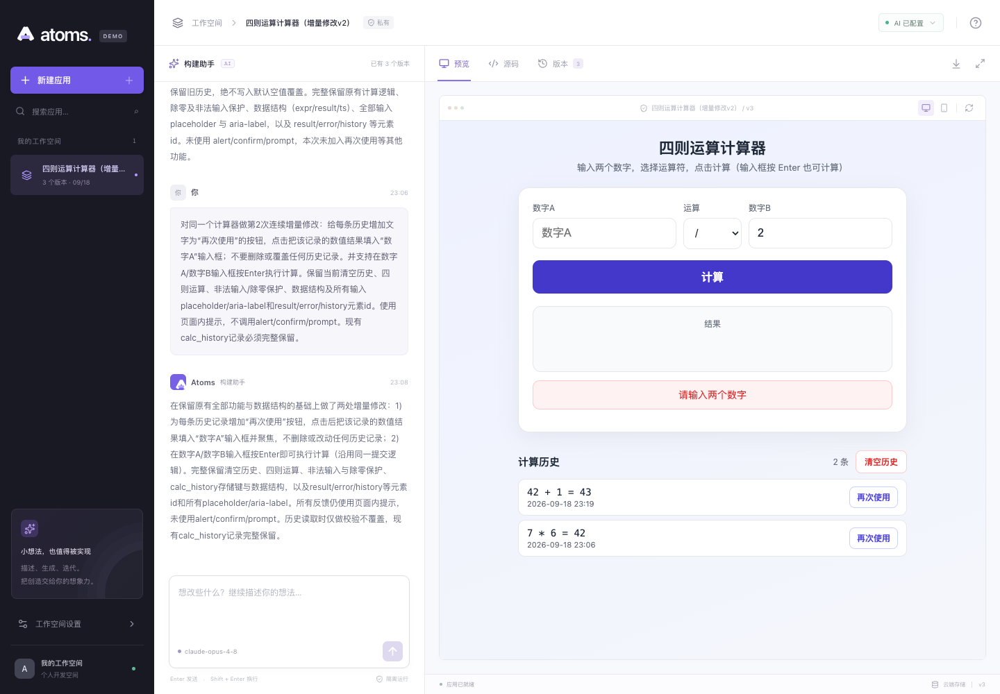
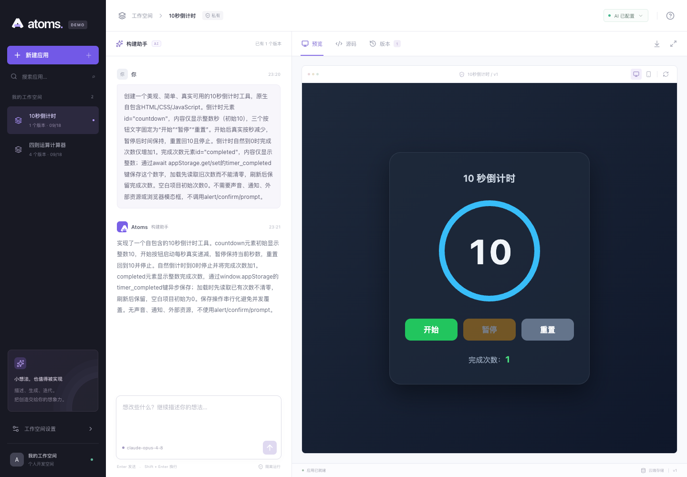

# 验收记录

记录日期：2026-09-18。结果区分平台测试、真实模型交互与真实云数据库检查，不将 fixture 或模拟适配器的通过结果当作真实模型验证。

- 在线工作台：https://atoms-demo-indol.vercel.app
- 公开源码：https://github.com/Alison-Lyun/atoms-demo
- [GitHub Actions](https://github.com/Alison-Lyun/atoms-demo/actions)：每次推送执行类型检查、单测与生产构建。

## 执行结果

| 检查 | 结果 | 已验证范围 |
| --- | --- | --- |
| 单元与集成测试 | 82 项通过 | 生命周期、存储、生成状态机、静态校验、HTTP、模型输出解析 |
| TypeScript / Next.js build | 通过 | 最终 TypeScript 类型检查与 Next.js 生产构建均通过 |
| 依赖审计 | 0 个已知漏洞 | 新目录 `npm ci --legacy-peer-deps`，锁文件安装 |
| 平台浏览器测试 | 3/3 通过，0 flaky | 真实 Chrome 预览发布、持久化与隔离、候选暂存、运行时失败回滚 |
| 真实模型待办 | 1/1 流程通过 | 首次生成、新增事项、云端保存、刷新、搜索追改、交互、恢复旧代码 |
| 生产环境计算器 | 首版、连续两次修改及恢复通过 | 三次生成均 ready、attempt=0；真实交互、错误输入、数据和代码均核对 |
| 生产环境计时器 | 完整交互通过 | 开始、暂停、重置、完成计数与刷新持久化 |
| Supabase | 真实边界检查全部通过 | 普通匿名身份真实 RPC、跨用户隔离、直接写表拒绝 |
| Vercel 公网接口 | 通过 | 首次会话、创建项目、生产 fixture 禁用、非法输入与跨来源拒绝 |
| 新目录 clone | 安装与启动通过 | 没有 `.env` 或历史数据，首页 200、新建 201、读取项目成功；明确显示模型未配置 |

## 平台与状态机

82 项单元与集成测试包含真实临时文件重开、会话隔离、40 路并发更新和抛错回滚。生命周期测试覆盖版本晋升、数据 revision 冲突、失败保留、取消及超时；engine 使用模拟模型与存储竞态测试幂等、有限重试和取消后的迟到结果。模拟检查不代表已进行云端取消或供应商错误注入测试。

正式 Chrome 平台运行在独立报告目录完成，耗时约 3.8 分钟，3 个用例全部通过：

1. fixture 经真实预览回报发布，新增数据在刷新后保留，并与另一项目隔离。
2. 候选写入在验证提交前不可见，提交后才进入当前项目。
3. 候选启动抛出真实运行时异常后失败，暂存数据不进入当前项目。

初期失败分别涉及启动等待时间、测试中切换存储环境和并行 runner 共用证据目录；最终正式复跑使用独立目录，不能把早期失败运行计为通过。生产环境没有 fixture 入口。

## 真实模型交互

模型配置为 OpenAI 兼容 Chat Completions 网关，返回的模型标识为 `claude-opus-4-8`。这是实际接入标识；不据此比较不同服务商模型质量。

| 应用 / 场景 | 实際操作与结果 | 状态 |
| --- | --- | --- |
| 待办首版 | 新增任务后真实云端保存，刷新后仍存在 | 通过 |
| 待办同项目修改 | 增加搜索；不匹配查询隐藏任务，匹配查询找回任务 | 通过 |
| 待办代码恢复 | 恢复首版后搜索消失，当前任务保留 | 通过 |
| 计算器首版 | `2+3=5`；`1÷0` 显示中文错误，不出现 Infinity/NaN，也不写历史；刷新保留历史 | 通过 |
| 计算器第一次修改 | 初始化保留旧历史；点击“清空历史”才清空；之后 `7×6=42` 正常保存 | 通过 |
| 计算器第二次修改 | 复用历史结果 42，按 Enter 得 43 且只新增一条历史；空输入与除零保护保留 | 通过 |
| 线上源码 / 导出 / 恢复 | 可见源码逐行一致，下载 HTML 字节一致；恢复首版，当前 42/43 历史仍在 | 通过 |
| 10 秒计时器 | 开始后真实递减，暂停保持、重置为 10，自然完成只加 1，刷新后次数仍为 1 | 通过 |

待办完整测试 1/1 通过，历时约 4.3 分钟；两次生成均无自动修复，恢复也进入 ready。待办通过本地工作台连接真实模型与真实 Supabase 验证；计算器和计时器使用公开 Vercel URL。

计算器原 runner 在第三版遇到定位失败：按钮显示“再次使用”，但可访问名称是更具体的“将结果 42 填入数字 A”。这是测试定位契约问题，不能据此宣称产品交互失败或通过。修正定位后使用同一匿名会话和既有三个版本续测，通过再次使用、Enter、空输入、除零、源码、导出和线上恢复，再完成唯一剩余的计时器生成与交互。续测正式结果 1/1 通过，历时约 2.7 分钟；未重复前三次付费生成。计算器三次生成、计时器一次生成均 ready，attempt=0。



网关首次真实调用曾返回 Markdown 代码块包裹的 JSON，导致结构化输出解析失败。适配器现只兼容纯 JSON 或完整单一 JSON 代码块，继续执行字段、HTML 与 JavaScript 校验；不会从任意说明文字中猜测代码。修复后的待办与计算器生成已通过。



## 云数据库与公开接口

已在真实 Supabase 执行迁移并启用 Anonymous Auth。两个独立匿名会话验证：A 可以创建和读取自己的项目；B 读取 A 的项目为 `null`，尝试修改返回 `P0002`；直接插入表返回 `42501`，被拒写入没有改变已有快照。应用 API 对跨会话访问返回 404。

真实并发测试发现，两个相同 revision 的写入中一个成功，另一个会超时；最终快照仍完整对应单一赢家，没有混入另一请求的消息或数据。根因是 PostgREST 14 对显式 `40001` 冲突无限事务重试。最小修复将业务 CAS 冲突改为 `PT409`，保留行锁、事务及所有权判断。官方依据见 [Supabase 故障说明](https://supabase.com/docs/guides/troubleshooting/high-cpu-and-infinite-transaction-retries-when-using-custom-error-codes-in-rpc-functions-77326b)，迁移方法见 [Supabase README](../supabase/README.md)。修复后以两个新匿名会话复验：恰好一个写入 204 成功，另一个返回 HTTP 409 / PT409，并发请求约 1.1 秒结束；最终消息与应用状态完整对应同一赢家。跨用户读写、直接插表拒绝均再次通过。复查没有残留快照 RPC，未终止其他请求或重启数据库。

公开 Vercel URL 已确认：首页 200、会话初始化 200、创建项目 201、生产 fixture 404、非法生成输入 400、外部 Origin 403、另一会话读项目 404。模型 key 未出现在浏览器 HTML 或静态 JS 中；源码提交扫描未发现已配置的私密值。

公开的脱敏运行结果见 [证据汇总](evidence/acceptance-summary.json)、[真实 Supabase CAS](evidence/supabase-live-cas-evidence.json)、[迁移核对](evidence/supabase-cas-migration-evidence.json) 和 [新目录启动](evidence/clean-clone-smoke.json)。原 runner 的中断记录与续测成功报告分别保留。

## 复现命令

```bash
npm ci --legacy-peer-deps
npm run typecheck
npm test
npm run build

# Chrome 平台检查，不调用付费模型
npx playwright install chrome
RUN_PLATFORM_TESTS=true npm run test:e2e

# 配置真实模型与存储后，显式开启付费调用
RUN_LIVE_MODEL=true npx playwright test tests/real-model.spec.ts
RUN_LIVE_MODEL=true RUN_PRODUCTION_ACCEPTANCE=true \
  PLAYWRIGHT_BASE_URL=https://your-deployment.example \
  npx playwright test tests/production-model.spec.ts
```

平台测试的本地服务必须启用 `ENABLE_DEV_FIXTURES=true`。生产模型测试必须禁用 fixture。默认报告位于 `test-results/platform` 或 `test-results/live`，可通过 `PLAYWRIGHT_OUTPUT_DIR` 指定独立目录。匿名会话文件包含访问凭据，不随证据公开，不提交 Git。

## 明确边界与未覆盖项

- 恢复只恢复代码，使用当前业务数据；没有历史数据快照。候选初始化写入也可能影响数据兼容性，因此需直接检查业务行为。
- 真实模型验收通过有限应用类型，不代表任意提示词都正确；启动成功不等于业务逻辑全部正确。
- 自动修复次数耗尽、取消后的迟到结果、180 秒超时有状态机测试；尚未对公网真实供应商逐项注入 401/429 或跨实例取消故障。
- iframe、CSP 和静态校验没有进程级 CPU/内存配额；没有安装依赖、多文件项目或后端生成能力。
- 匿名会话清理 cookie 后不可找回；尚无账户升级、多人协作或跨设备登录。
- 当前生成限流按项目计数；长期公开服务需要账户/IP 级限流、访问控制、费用上限与匿名注册防滥用。
