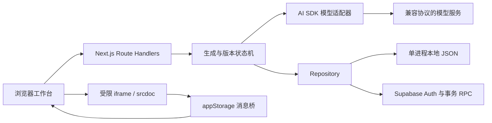
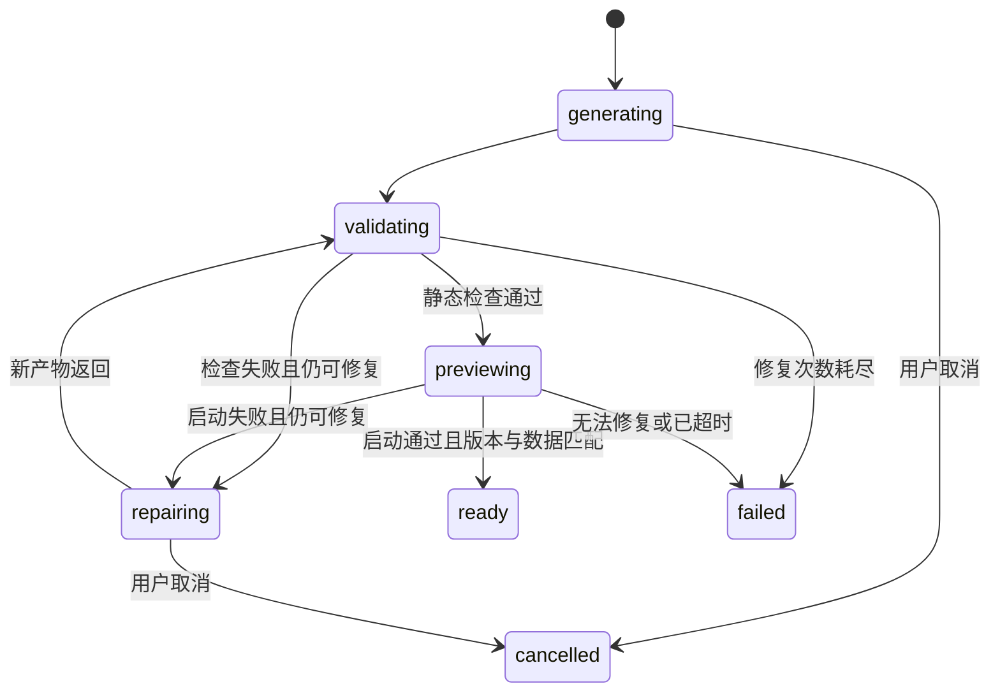

# 架构与状态约束

一次修改只有在候选代码启动成功、数据 revision 仍匹配时，才替换当前版本。这个约束贯穿生成、预览、持久化和恢复流程，避免新代码失败时连带覆盖已可用的应用及数据。

## 调用关系

工作台是 React 应用，生成的产物是完整 HTML 文档。模型输出不会在服务器上作为程序执行；服务器负责调用模型、校验产物和管理快照。预览代码在浏览器的独立 iframe 中运行。

| 代码位置 | 职责 |
| --- | --- |
| `src/components/Workspace.tsx` | 项目、聊天、代码、版本界面；读取生成事件并提交预览回报 |
| `src/components/PreviewFrame.tsx` | 预览实例、启动检查、数据暂存和存储请求队列 |
| `src/lib/preview-document.ts` | 注入 CSP 与宿主提供的存储桥 |
| `src/lib/validation.ts` | HTML 和脚本静态检查 |
| `src/lib/server/model.ts` | 模型配置、结构化输出与公开错误分类 |
| `src/lib/server/engine.ts` | 生成、自动修复、取消、恢复和 CAS 重试 |
| `src/lib/server/lifecycle.ts` | 任务状态、晋升前置条件、数据校验 |
| `src/lib/server/repository.ts` | 本地文件和 Supabase 快照存取 |
| `src/lib/server/session.ts` | 本地匿名 cookie、Supabase 身份校验与 cookie 刷新 |

以上路径相对于仓库根目录。公共类型见 `src/lib/types.ts`。

## 从请求到发布

1. API 校验请求来源、输入结构与大小，取得当前身份绑定的 Repository。
2. `beginGeneration` 检查 request ID、当前版本、活跃任务和项目频率限制，创建 run。`baseVersionId` 与 `baseDataRevision` 记录生成起点。
3. 模型得到本次需求及上一个成功版本的 HTML。返回结构化的标题、说明、HTML 和固定的数据协议版本。
4. 静态校验通过后，将 HTML 保存为 `candidate` 并交给浏览器预览；失败产物记录为 `failed`，有剩余次数时进入修复。
5. 预览完成握手、页面加载及初始存储请求后，在短暂稳定窗口结束时回报。启动超时或运行时异常触发失败回报。
6. 服务端重新核对 run、候选版本、当前代码版本和数据 revision。全部匹配才一次性提交 `currentVersionId`、`appState`、版本状态、run 结果和助手消息。

生成路由返回 NDJSON 状态与快照事件。事件流结束并不一定表示应用已经发布：`candidate` 还要经过浏览器回报。页面会对活跃任务轮询，重新打开项目也会读取持久化状态。

图中省略了各活跃状态的通用失败和取消边。一次生成最多自动修复两次，任务总截止时间为 180 秒。模型凭据错误、限流和请求失败会结束本次生成；静态检查与浏览器启动失败可进入修复。启动通过只证明初始化阶段可运行，不能证明业务逻辑正确。

## 数据提交与代码恢复

`appState` 是项目级 JSON 对象。已发布预览中的 `appStorage.set()` 等到服务端保存完成后才收到成功回应，失败会返回给应用。候选预览的写入只修改浏览器暂存副本；候选失败、取消或被替代后，这些写入不会落到当前数据。

活动生成期间，当前预览的数据写入被锁定。晋升时还会核对 `baseDataRevision`，因此来自旧数据的成功回报也不能覆盖新数据。数据最多 64 KiB、100 个键，键名为 1–64 位 ASCII 字母、数字、下划线或连字符；拒绝危险键名、非有限数字和过深结构。

恢复选择的是一个 `ready` 版本的代码。系统新增恢复任务及候选版本，携带当前数据走同一套预览和晋升流程；原版本记录保留。应用没有按版本存历史数据快照，所以不存在按时间点回滚业务数据的能力。旧代码初始化时如果修改数据，这些候选写入会与代码一起提交，验收应检查旧代码是否理解当前数据格式。

## 并发与幂等

同一预览的存储请求由消息桥与宿主队列串行处理，每次保存使用最新 `dataRevision`。跨页面旧快照发生 409 后，宿主立即冻结旧预览并使其队列失效。恢复操作先等待已经发出的写入结束，再读取云端项目、更新数据和版本、重建 iframe；不重放失败的旧值。读取失败时继续冻结并保留恢复按钮，避免“刷新了界面却仍使用旧 revision”的循环。恢复横幅位于输出区，在手机与全屏预览中均可见。

本地 Repository 按项目文件使用进程内锁，先读最新内容，在独立 draft 上执行同步 mutation，再写临时文件并原子替换。mutation 抛错时不写文件。此锁不协调多个 Node 进程。

Supabase 的 `save_project_snapshot` 先锁项目行并比较 `expected_revision`，随后在一个事务中保存项目、消息、版本、运行状态和数据。任意约束失败都会回滚整个快照。`load_project_snapshot` 用单条 SQL 读取，避免拼接出不同提交时点的分表数据。

生成、预览回报和取消中的内部写入只重试 `REVISION_CONFLICT`：首次尝试失败后最多再试三次，每次都读取新快照。回调只修改本次 draft，模型调用和修复派发不放在可重放的回调里。`STALE_DATA`、`STALE_CANDIDATE` 和 `RUN_INACTIVE` 等语义错误直接返回。

重复 request ID 和已完成预览回报先只读返回。若相同操作在读后才提交，mutation 内的检查会中止无效写入，避免无操作也增加 revision。持续 CAS 冲突耗尽重试时返回最新快照与 409，活跃任务由后续取消或截止时间回收。

## 身份与权限

本地会话使用 32 字节随机 cookie，设置 HttpOnly 和 SameSite。owner 值经哈希映射到存储目录，项目 API 不返回 owner 标识。

Supabase 模式使用 SSR cookies。服务端通过 `getUser()` 验证已有身份，无会话时创建匿名用户，并将刷新后的 cookie 随响应发送。这个步骤必须在流式响应开始前完成。清除匿名 cookie 后，没有账户恢复流程可以找回项目。

云数据库有五张表：`projects`、`messages`、`versions`、`runs`、`app_state`。查询受 RLS 约束，子表的 `(project_id, owner_id)` 复合外键将数据绑定到项目所有者。普通客户端没有直接写表权限；写 RPC 显式校验 `auth.uid()`。应用不使用 service-role key。

## 预览边界

iframe 仅启用 `sandbox="allow-scripts"`，不授予 same-origin。CSP 禁止联网、嵌套页面、worker、对象、表单提交和基础 URL 修改；生成代码使用内联样式和脚本。消息桥验证 iframe window、来源、通道、实例 nonce 和递增请求 ID，数据请求按队列处理。切换项目或版本后，旧实例的消息不再生效。

这套机制没有容器、服务端执行环境或浏览器进程级资源限制。CPU 密集循环可能影响当前标签页；静态检查也不是对任意恶意 JavaScript 的形式化证明。当前模型契约因此只允许不联网的单文件应用。

## 故障与运行限制

取消先保存 `cancelled` 状态，再中止本进程持有的模型请求。部署到多个实例时，取消请求可能到达另一个实例；已有模型请求可能继续计费，但它在提交结果前仍要验证任务状态。失败、取消和迟到回报都不能替换当前可用代码或数据。

Vercel 上必须使用 Supabase。生产环境缺少持久化配置会拒绝操作，不会自动改用临时磁盘。本机生产预览可以显式设置 `ATOMS_ALLOW_LOCAL_STORAGE=true`。

现有频率限制只按项目计算生成任务，可被新建项目绕过，也没有整体模型费用预算。公网运营还需账户/IP 限流、访问控制、费用监控和匿名注册防滥用。项目清理、正式登录、跨设备找回及数据库级运维验证尚未交付。
